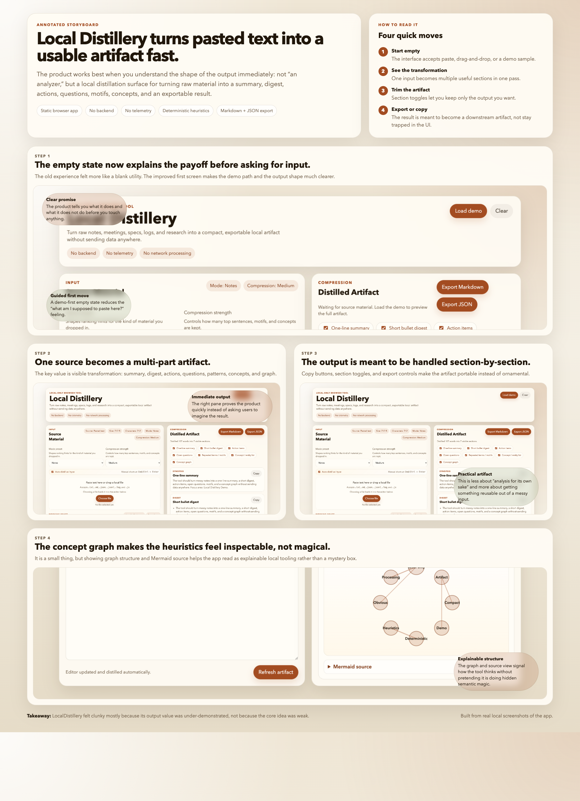

# Local Distillery

Local Distillery is a local-only browser tool for turning rough text into a compact artifact you can actually use. Paste notes, meeting transcripts, specs, logs, or research, and it distills them into a one-line summary, digest, actions, open questions, motifs, concepts, and an exportable output bundle.

- No backend
- No account system
- No analytics
- No network processing for the core app
- Deterministic heuristics instead of black-box summarization



## Why it feels useful

Local Distillery works best when you have raw material that is too messy to skim comfortably but too lightweight to justify a heavyweight workflow. It is meant to feel like a compact instrument:

- fast enough to use on throwaway notes
- structured enough to produce a reusable artifact
- inspectable enough that the output does not feel magical or arbitrary
- local enough to use on sensitive drafts without shipping them anywhere

## Start here

From the repo root:

```bash
make local-distillery-serve
```

Then open [http://localhost:4173](http://localhost:4173).

You can also run it directly:

```bash
cd LocalDistillery
python3 -m http.server 4173
```

Then open [http://localhost:4173](http://localhost:4173).

## What it produces

- one-line summary
- short bullet digest
- extracted action items
- extracted open questions
- repeated terms and motifs
- concept and entity list
- Mermaid concept graph
- Markdown and JSON exports

It also supports mode presets for notes, meetings, research, logs, and specs, plus adjustable compression strength.

## How it works

Everything in v1 is deterministic and browser-local.

1. The app normalizes the input and splits it into sentence-like chunks.
2. It counts repeated informative terms after removing common stop words.
3. It ranks chunks using simple cues such as repetition, numbers, action-like phrasing, and mode-specific hint words.
4. It extracts task-like lines, open questions, recurring phrases, and lightweight entities.
5. It assembles the results into a compact artifact that can be copied section-by-section or exported.

The concept graph is intentionally shallow. It is there to expose structure, not to imply deep semantic understanding.

## Privacy

- Processing happens in the browser
- No text is uploaded
- No telemetry is included
- No login is required
- Working state is stored locally via `localStorage`

## Limits

This is a heuristic distiller, not a reasoning engine. It can surface patterns and likely important sentences, but it cannot verify facts, infer hidden intent, or replace careful reading for high-stakes material. The output is best used as a compact first pass and exportable working artifact, not as a final source of truth.

## Repo map

- `LocalDistillery/index.html`: app shell and layout
- `LocalDistillery/styles.css`: local-first console-style presentation
- `LocalDistillery/app.js`: browser-side orchestration, analysis wiring, rendering, and export flow
- `LocalDistillery/src/analyzer.js`: deterministic extraction heuristics
- `LocalDistillery/src/storage.js`: `localStorage` persistence helpers
- `LocalDistillery/src/demoText.js`: built-in demo material
- `LocalDistillery/storyboard/local-distillery-storyboard.png`: annotated visual walkthrough
