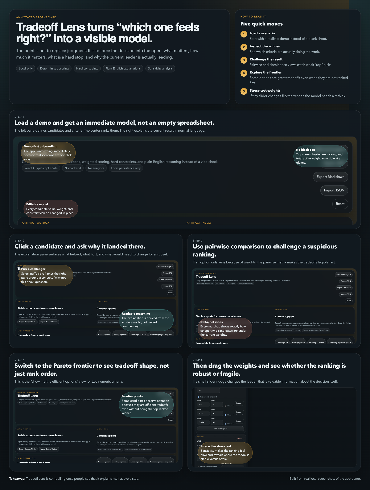

# friendly-octo-memory

## Tradeoff Lens

Tradeoff Lens is the main product in this repo: a local-only decision tool for comparing options under explicit criteria, weights, and hard constraints.

It is built for the moment when a choice is too important for a vibe check but too subjective for a simple spreadsheet. Instead of pretending the answer is obvious, it makes the tradeoffs visible: what matters, how much it matters, what disqualifies an option, and why the current winner is ahead.

- Local-only browser app
- React + TypeScript + Vite
- No backend, accounts, or analytics
- Deterministic and inspectable scoring
- Plain-English explanations layered on top of the scoring model



## Why it feels different

Most comparison tools either collapse into a giant table or hide the reasoning behind a final score. Tradeoff Lens is trying to sit in the middle:

- structured enough to rank options consistently
- transparent enough that you can challenge the model
- fast enough to feel like an instrument instead of a form
- flexible enough to compare products, projects, shows, tools, or plans

Core v1 includes:

- candidate editing with notes and demo datasets
- numeric, boolean, enum, and note criteria
- hard-constraint exclusion with explicit reasons
- weighted ranking with numeric normalization
- pairwise comparison and dominance detection
- Pareto frontier view for numeric tradeoffs
- sensitivity sliders to test weight changes
- Markdown and JSON export

## Start here

Repo-root shortcuts:

```bash
make tradeoff-lens-dev
make tradeoff-lens-build
make tradeoff-lens-preview
```

Direct app commands:

```bash
cd /Users/henry/friendly-octo-memory/TradeoffLens
npm install
npm run dev
```

Built-app preview:

```bash
cd /Users/henry/friendly-octo-memory/TradeoffLens
npm run build
npm run preview
```

More detail lives in `TradeoffLens/README.md`.

## Also in this repo

### Local Distillery

Local Distillery is a second local-first browser tool in this repo. It focuses on text distillation rather than decision analysis.

- Direct entry: `LocalDistillery/index.html`
- Docs: `LocalDistillery/README.md`

## Repo map

- `TradeoffLens`: main decision-analysis app
- `TradeoffLens/storyboard/tradeoff-lens-storyboard.png`: product walkthrough graphic
- `LocalDistillery`: secondary text-distillation app
- `Makefile`: repo-root shortcuts for running Tradeoff Lens
