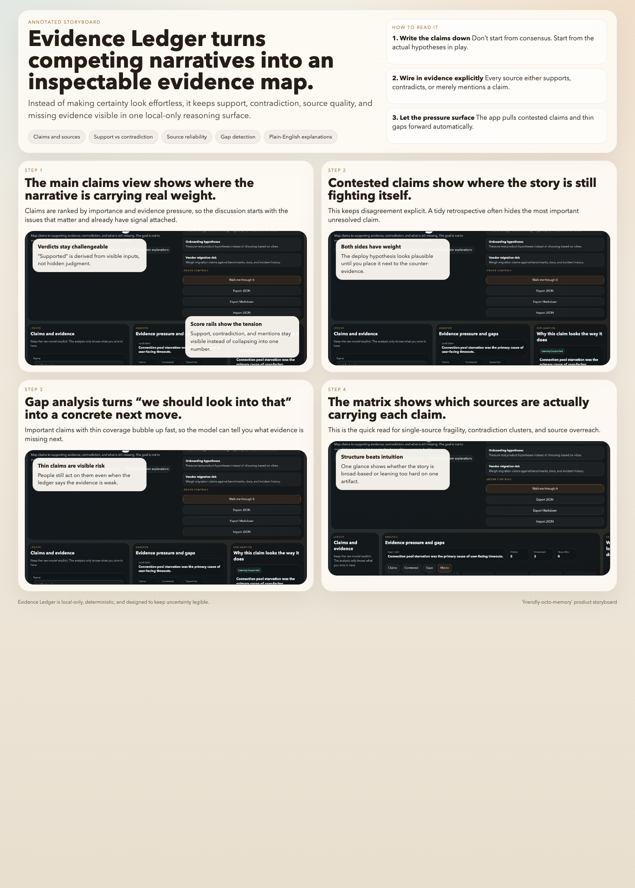

# friendly-octo-memory

`friendly-octo-memory` is turning into a small suite of local reasoning instruments: browser tools that help you distill raw material, pressure-test claims, compare options, and map execution without shipping data to a backend or hiding the logic behind a black box.

- local-only browser apps
- no accounts or analytics
- deterministic, inspectable models
- plain-English explanations layered on top of the model

## The spine

The four tools fit together around one workflow:

1. `Local Distillery`: understand the material
2. `Evidence Ledger`: pressure-test the narrative
3. `Tradeoff Lens`: choose the direction
4. `Threadline`: land the work

The point is not to make complexity disappear. The point is to make it feel juggleable.

## Suite gallery

### Local Distillery

Local Distillery is the text-distillation tool: a local-only way to turn rough notes, transcripts, specs, logs, and research into a compact working artifact.

- deterministic heuristics, not opaque summarization
- outputs summary, digest, actions, questions, motifs, concepts, and graph
- best when the input is messy but the output should stay compact


Quick start:

```bash
make local-distillery-serve
```

More detail lives in `LocalDistillery/README.md`.

### Evidence Ledger

Evidence Ledger is the evidence-mapping tool: a local-only app for comparing claims against supporting sources, contradiction, and what evidence is still missing.

- deterministic evidence scoring from source reliability, strength, and confidence
- claims, contested, gap, and matrix views
- best when a neat story is arriving too early and the real need is to keep uncertainty visible



Quick start:

```bash
make evidence-ledger-dev
```

More detail lives in `EvidenceLedger/README.md`.

### Tradeoff Lens

Tradeoff Lens is the decision-analysis tool: a local-only app for comparing options under explicit criteria, weights, and hard constraints.

- deterministic and inspectable scoring
- pairwise, dominance, Pareto, and sensitivity views
- best when the answer should be challengeable rather than vibe-based


Quick start:

```bash
make tradeoff-lens-dev
```

More detail lives in `TradeoffLens/README.md`.

### Threadline

Threadline is the planning instrument: a local-only tool for turning complicated work into an executable plan across tasks, dependencies, capacity, and uncertainty.

- deterministic schedule engine with critical-path and slip-impact analysis
- timeline, dependency map, diagnostics, and scenario-diff views
- best when the real problem is coordination, queueing, and schedule pressure


Quick start:

```bash
make threadline-dev
```

More detail lives in `Threadline/README.md`.

## Why these belong together

Each tool specializes in a different kind of complexity:

- `Local Distillery` turns source chaos into a usable artifact.
- `Evidence Ledger` turns competing narratives into an inspectable evidence picture.
- `Tradeoff Lens` turns ambiguity into an explicit decision model.
- `Threadline` turns a complicated goal into an inspectable execution model.

They are intentionally not forced into one fake shared app. The common layer is the philosophy: local-first, legible, deterministic, and built to make hard things feel calm.

## Start here

Repo-root shortcuts:

```bash
make local-distillery-serve
make evidence-ledger-dev
make evidence-ledger-build
make evidence-ledger-preview
make tradeoff-lens-dev
make tradeoff-lens-build
make tradeoff-lens-preview
make threadline-dev
make threadline-build
make threadline-preview
```

## Repo map

- `LocalDistillery`: text distillation app
- `LocalDistillery/storyboard/local-distillery-storyboard.png`: Local Distillery walkthrough
- `EvidenceLedger`: claim-and-evidence analysis app
- `EvidenceLedger/storyboard/evidence-ledger-storyboard.png`: Evidence Ledger walkthrough
- `TradeoffLens`: decision-analysis app
- `TradeoffLens/storyboard/tradeoff-lens-storyboard.png`: Tradeoff Lens walkthrough
- `Threadline`: planning and execution-mapping app
- `Threadline/storyboard/threadline-storyboard.png`: Threadline walkthrough
- `Makefile`: repo-root shortcuts for the suite
- `index.html`: static browser launcher/gallery for all four tools
