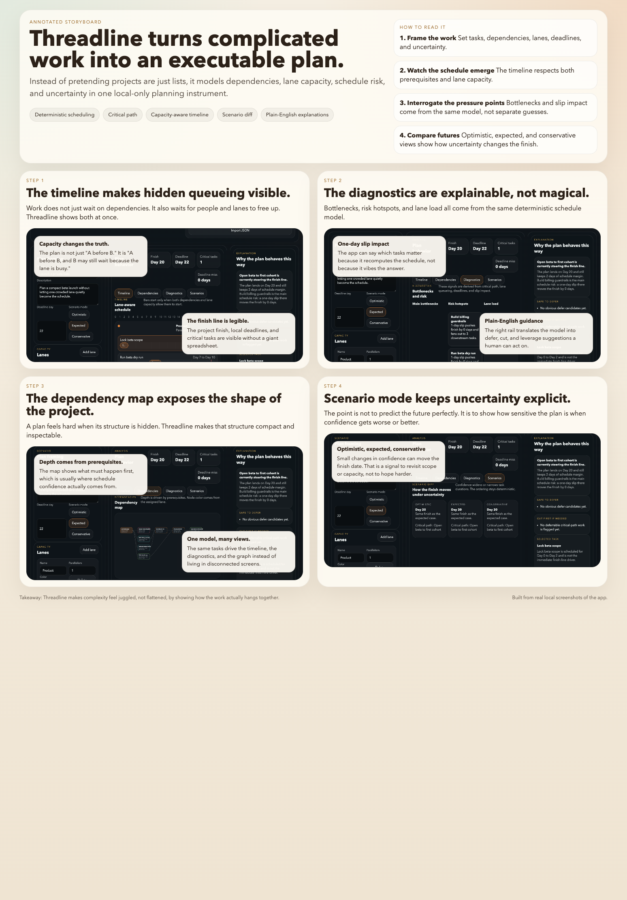

# Threadline

Threadline is a local-only browser tool for turning complicated work into an executable plan. It models tasks, dependencies, lane capacity, deadlines, and uncertainty in one inspectable planning instrument, then explains why the current schedule behaves the way it does.

- No backend
- No account system
- No analytics
- Deterministic scheduling
- Plain-English explanations on top of the planning model



## Why it feels different

Most planning tools either flatten everything into a list or bury the schedule logic behind a heavy project-management surface. Threadline is trying to sit in the middle:

- structured enough to expose dependency and capacity problems
- compact enough to feel like an instrument instead of a process tax
- explainable enough that bottlenecks do not feel arbitrary
- local enough to use on sensitive planning material without shipping it anywhere

## What it does

- add, edit, duplicate, and delete tasks
- model tasks with estimate, confidence, status, owner, notes, dependencies, earliest start, and must-finish day
- model lane capacity with configurable parallelism
- compute a deterministic schedule that respects dependencies and lane queues
- show a lane-aware timeline, dependency map, diagnostics view, and scenario diff
- flag critical-path tasks, lane bottlenecks, local deadline misses, and slip impact
- explain selected tasks in plain English
- persist the current scenario in `localStorage`
- import and export scenarios as JSON
- export an analysis summary as Markdown
- include built-in demo scenarios for a beta launch, service migration, and talk/workshop rollout

## Run locally

### Dev mode

```bash
cd Threadline
npm install
npm run dev
```

Then open the local Vite URL shown in the terminal, typically `http://localhost:5173` or the next free port.

If you want a repo-root shortcut instead:

```bash
make threadline-dev
```

### Built app

To produce the production bundle:

```bash
cd Threadline
npm run build
```

This writes the compiled app to `dist/`.

To preview the built app locally:

```bash
cd Threadline
npm run preview -- --host 0.0.0.0
```

Or from the repo root:

```bash
make threadline-preview
```

### Test

```bash
cd Threadline
npm test
```

## Project structure

- `Threadline/index.html`: Vite entry HTML
- `Threadline/src/App.tsx`: main React UI and layout
- `Threadline/src/domain/planning.ts`: scheduling, critical path, lane capacity, delay impact, and scenario summaries
- `Threadline/src/domain/explanations.ts`: plain-English task explanations
- `Threadline/src/domain/markdown.ts`: Markdown export builder
- `Threadline/src/data/demos.ts`: built-in planning demos
- `Threadline/src/utils/storage.ts`: local persistence
- `Threadline/tests/planning.test.ts`: unit tests for the planning engine
- `Threadline/storyboard/threadline-storyboard.png`: annotated product walkthrough

## Scheduling math

### 1. Dependency-first ordering

Tasks are topologically ordered from their declared dependencies. If a dependency cycle exists, the app still produces a deterministic order, but it flags the cycle so the model can be repaired.

### 2. Capacity-aware scheduling

Each lane has a parallelism count. When a task becomes dependency-ready, Threadline places it in the first lane slot that can start it. That means start time is driven by both:

- dependency readiness
- lane availability

This is the main reason the tool can expose hidden queueing instead of just dependency chains.

### 3. Scenario modes

Each task has an estimate and a confidence score. Confidence widens the task duration depending on the selected mode:

- optimistic: shorter than base when confidence is low, but never below 1 day
- expected: the base estimate
- conservative: longer than base when confidence is low

Done tasks contribute `0` remaining days.

### 4. Critical path and slack

After scheduling, Threadline builds an augmented precedence graph that includes both:

- declared dependency edges
- lane-queue edges created by capacity serialization

Slack is computed with a reverse pass over that graph. Tasks with effectively zero slack are treated as critical-path work.

### 5. Slip impact

For each task, Threadline reruns the schedule with that task stretched by one day. The delta in finish day and moved tasks becomes the task's slip-impact signal.

## Limits

- This is a planning model, not a guarantee. Bad inputs still produce confident-looking output.
- Durations are intentionally simple. Real teams may need hours, calendars, and varying capacity over time.
- Confidence is a coarse uncertainty proxy, not a probabilistic forecast.
- Lane serialization captures a lot of real schedule pain, but not every organizational dependency.
- Critical path and slip impact help expose leverage, but they do not replace judgment about value or sequencing politics.
