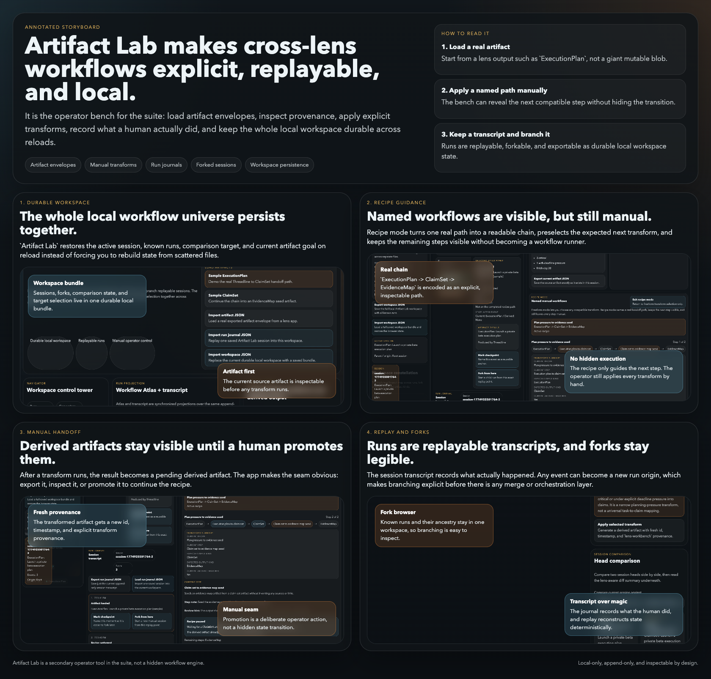
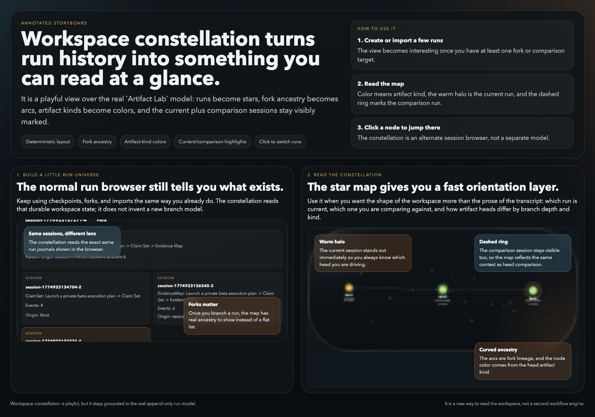

# Lens Workbench

`lens-workbench` is a tiny sandbox app for the extracted `packages/lens-core` chassis.

It intentionally does **not** contain a generic engine or workflow runner. It is an operator bench for the shared shell, artifact envelopes, and explicit transforms.

Artifact Lab now persists a full local workspace bundle. That bundle includes known run journals, forks, the active session, head-comparison state, and the current target artifact kind.



Artifact Lab is the suite's interop surface: load a typed artifact, inspect provenance, apply a narrow transform, record the manual session as a replayable journal, and keep the whole local workspace durable across reloads.

## Workspace constellation



The `Workspace constellation` panel is a playful view over the real run-journal model. It does not create new state or invent a new branch system; it just gives you a faster way to read the current workspace.

How to use it:

1. Create or import at least a couple of runs.
2. Fork once or twice if you want the map to show real ancestry arcs.
3. Scroll to `Workspace constellation`.
4. Read the markers:
   - node color = head artifact kind
   - warm halo = current session
   - dashed ring = comparison session
   - curved links = fork ancestry
5. Click any node to switch the active session.

It is most useful once the workspace stops being a single linear run and starts looking like a small local workflow universe.

## Workflow atlas

`Workflow Atlas` is the detailed companion to the constellation overview.

- `Workspace constellation` = high-level branch/head overview across the whole workspace
- `Workflow Atlas` = detailed projection of one run journal into events, checkpoints, recipe progress, artifact states, and fork origin
- transcript = the append-only textual view of the same journal

These are all projections over the same durable workspace and run-journal data. The journal and workspace bundle remain the source of truth.

Atlas gives you:

- event-to-transcript synchronization in both directions
- checkpoint and fork actions from the graph surface
- recipe overlay showing completed vs remaining transform steps
- observed transform-path selection groundwork for future recipe promotion

## Manual artifact flow

The current real cross-lens path is:

1. In `Threadline`, export an `ExecutionPlan` artifact
2. In `Artifact Lab`, import that artifact and apply `execution-plan-to-claim-set`
3. Export the derived `ClaimSet` artifact
4. In `EvidenceLedger`, import the `ClaimSet` artifact to seed claims with empty sources and links

This is intentionally manual and inspectable. The point is to make the handoff legible before any future workflow runner exists.

## Freeform mode vs recipe mode

Artifact Lab has two operator modes:

- Freeform mode: choose any compatible transform for the current artifact
- Recipe mode: activate a named manual workflow and let the lab preselect the expected next transform

Recipe mode is still manual and inspectable. It does not run steps for you, hide intermediate artifacts, or keep background workflow state. It only makes a known path easier to follow.

Artifact Lab also shows a simple path-to-target preview for registered transforms. That preview is only discovery help. Execution is still manual, one transform click per step.

There is also a small `Use next step toward target` helper in the lab. It only preselects the first transform in the visible path; it does not run anything for you.

The first named recipe is:

- `ExecutionPlan -> ClaimSet -> EvidenceMap`

## Runs, forks, and workspace persistence

- Run journals record one append-only manual session.
- Forks create a new run journal from an earlier replay point and preserve fork ancestry.
- Head comparison lets you compare the current run head against another known local run.
- Workspace persistence stores the whole local operator state in `localStorage`, not just one run.
- Workspace constellation gives you a quick visual read on current vs comparison runs and fork lineage.
- Workflow Atlas gives you a richer event-and-state projection over the currently selected run.

Artifact Lab now distinguishes three different import/export surfaces:

- Artifact import/export: one artifact envelope such as `ExecutionPlan`, `ClaimSet`, or `EvidenceMap`
- Run-journal import/export: one append-only session transcript
- Workspace import/export: the full local workspace bundle, including known runs, current session, comparison state, and target selection

Workspace import replaces the current local Artifact Lab workspace after shape validation. Run-journal import keeps the current workspace and adds or updates one known session inside it.

## Transform limitations

`execution-plan-to-claim-set` is deliberately narrow.

- It does not convert every task into a claim.
- It only projects non-done tasks that are schedule-critical or carrying explicit deadline pressure.
- It carries task notes and constraint text forward, but it does not infer evidence, sources, or verdicts.
- The imported `EvidenceLedger` scenario is just a seed that still needs human curation.

## Run locally

```bash
cd apps/lens-workbench
npm install
npm run dev
```

Or from the repo root:

```bash
make lens-workbench-dev
```

## Test

```bash
cd apps/lens-workbench
npm test
```
